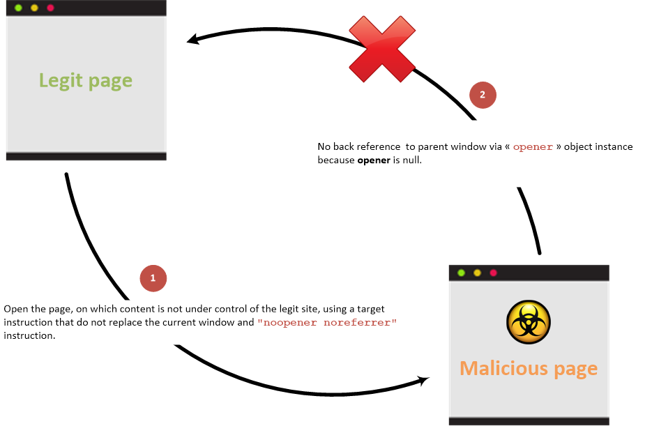

% title: Reverse Tab Nabbing
% date: 2024-06-25
% description: A writeup on the tab nabbing vulnerability.
% type : post
% tags: pentesting,cybersec,vulnerability

# What is it?
Let's assume a webpage contains a link which the user wants to visit. When the user clicks on the link it appears that he was logged out. When the user visits the original tab from where they clicked the link, he realized that the page and his credentials have been compromized! This is a textbook case of reverse tab nabbing.

Here is a flow diagram to illustrate the same: 


<sub>[Source](https://owasp.org/www-community/attacks/Reverse_Tabnabbing)</sub> 
# Let's get a bit more technical
When you click on a link with a `target` attribute, the target window gets access to the `opener` property which returns the context of the window that opened it. 

Now there can be one of 2 cases: the target is *same-origin* or *cross-origin*. Same-Origin targets give the target full access to all window properties giving the bad actor the ability to control, well, the entire window. They get access to session history, ability to open new windows, launch popups, resize, reload and the full array of DOM features.

More about window properties [here](https://www.sitepoint.com/javascript-window-object/). Cross-Origin targets have a more limited access to properties though even they can replace the URL of the main page to redirect the user into a phishing site.
This also works when the current page and the target are [cross-origin](https://fetch.spec.whatwg.org/#http-cors-protocol).

Usually links with the `target='_blank'` and `rel="opener"` or even links without an explicit `rel="noopener"` may be vulnerable to this type of attack. A common way to abuse this is by:

```javascript

window.opener.parent.location.replace("custom.html")
// OR
window.opener.location = "custom.html"

```

Both if these replace the original page with a spoofed one usually a login form which register user credentials on the attacker's backend. 

# Accessible Properties

Under Cross-Origin redirects, the following properties of `window` are accessible to the target.

- `opener.frames` : access to iframe elements on the page.
- `opener.parent` : parent window of the current window.
- `opener.opener` : window object of the window that opened the current window.
- `opener.top` : returns topmost browser window.
- `opener.self` : context on the current window itself.
- `opener.closed` : bool, determines if window has been closed.
- `opener.length` : number of iframe elements in the window.

In the case of Same-Origin, the target can access all the properties of the window object.

# Prevention
> If you're using any mainstream browser *post* 2020/21 this issue has already been [patched](https://portswigger.net/daily-swig/upcoming-google-chrome-update-will-eradicate-reverse-tabnabbing-attacks) which implicitly sets `rel="noopener"` for `target=_blank`. This implicit behaviour has also been added to the [HTML5 standard](https://github.com/whatwg/html/issues/4078).

- Use of the `rel="noopener"` attribute. Sets the opener object to `null` on the target window.
- Use of the `rel="noreferrer"` attribute. This doesn't pass the referrer header to the target, masking the origin site.


<sub>[Source](https://owasp.org/www-community/attacks/Reverse_Tabnabbing)</sub>

# References
- [OWASP](https://owasp.org/www-community/attacks/Reverse_Tabnabbing)
- [MDN](https://developer.mozilla.org/en-US/docs/Web/API/Window/opener)
- [caniuse](https://caniuse.com/?search=noreferrer)
- [About "noopener"](https://mathiasbynens.github.io/rel-noopener/)
